# Experiment for Clustering in Aggregate Computing

This repository contains the first experiment that explores the clustering techniques
applied in Aggregate Computing.

This work starts from this [idea](https://github.com/metaphori/paper-2021-swarm-intelligence-si/blob/master/_Brainstorming/algorithm1.txt)

In [Experiments](#experiments) I briefly discuss the current state of the simulation performed.
Each entry has the form of: 
### Name 
> simulation file. 

To run a simulation, you can write ./gradlew run<SimulationFile> 
(I leave the command at the end of each section).
The experiment body is structured as:
- current status: (:+1: ok, clustering seems to work; :-1: ko, clustering do not find good clusters; :open_hands: the experiment lead to no conclusion)
- a brief description of the simulation setup (nodes, clusters to find, ...)
- simulation snapshots
- plots
In [Todo](#todo) is present the relevant works that will have to do.

In [Problems](#problems) I underline the limitations/current problem that we have discovered.

## Legenda
### Simulation
- node temperature A circle that goes from yellow (low temperature) to red (high temperature)
  
| Low temperature | High Temperature |
|---|---|
|   |   |
  
- candidate node: A node that starts the cluster expansion process (the green circle)
  

  
- clusters: each subdivision rapresent a different cluster found (here we have 4 cluster)
  


  
### Plots
Taking this example:

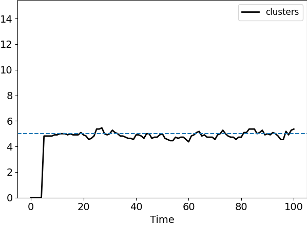

The dotted line expresses the real number of clusters.
The black line shows the cluster founded by the aggregate program
## Experiments

### Gaussian Distributions
> *standardPatterns*

:+1:

In this experiment, there are five disjointed clusters that follows a gaussian distribution.

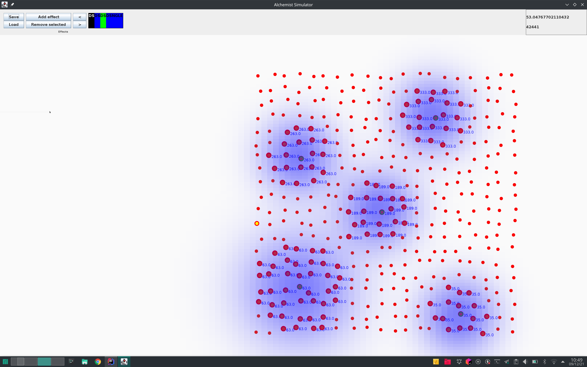

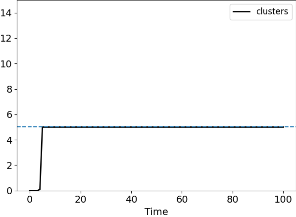
```
./gradlew runStandardPatternsGraphic 
```

### Gaussian Distributions with Brownian movement
> *standardPatterns*

:open-hand:

In this experiment, there are five disjointed clusters that follows a gaussian distribution.

The agents move following a browian movement.
Multiple process starts but, in general, the number of cluster is quite stable.
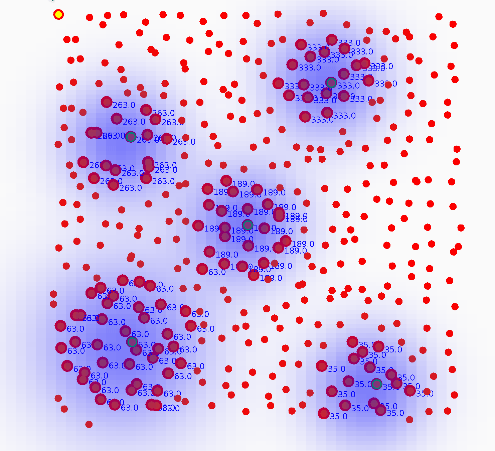


```
./gradlew runStandardPatternsGraphic 
```


### Gaussian Overlays
> *overlayPatterns*

:open_hands:

In this experiment, there are four joined clusters that follow a gaussian distribution.
Moreover, there is one disjointed cluster from the others.

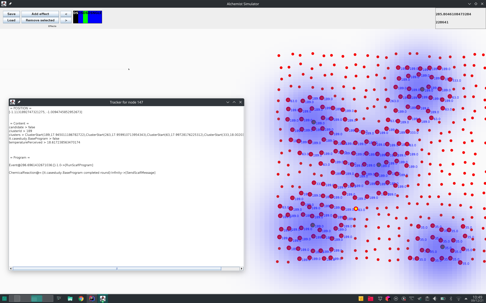

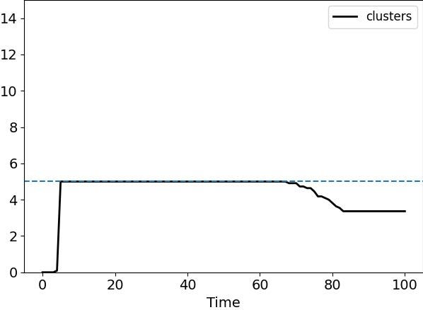
**NB! Here the merge strategy does not produce the correct clusters.**
```
./gradlew runOverlayPatternsGraphic 
```

### Stretched Gaussian Distribution 
> *stretchedOutPatterns*

:+1:

In this experiment, there are four disjointed clusters with a gaussian distribution but stretched.


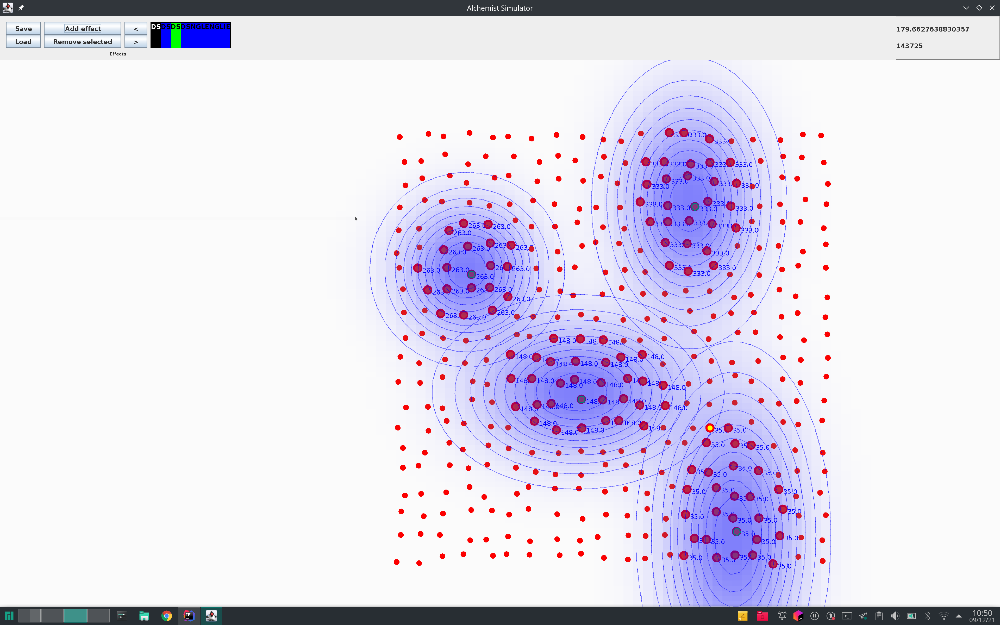

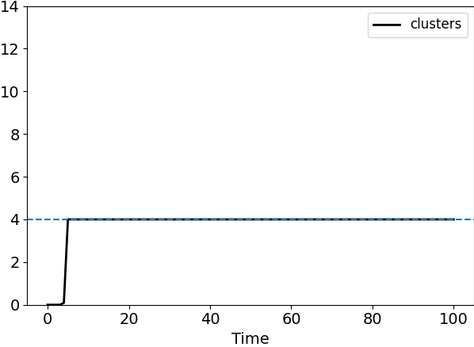
```
./gradlew runStretchedOutPatternsGraphic 
```

### Uniform Layers Distribution
> *uniformLayers*

:+1:

In this experiment, there is one cluster with a uniform value (convex, a rectangle).
Due to the fact the cluster is uniform, the candidate selection goes wrong, and the program finds more pattern (3).

But, using a merge strategy, the program cluster eventually find the correct cluster number (but it needs more computation).
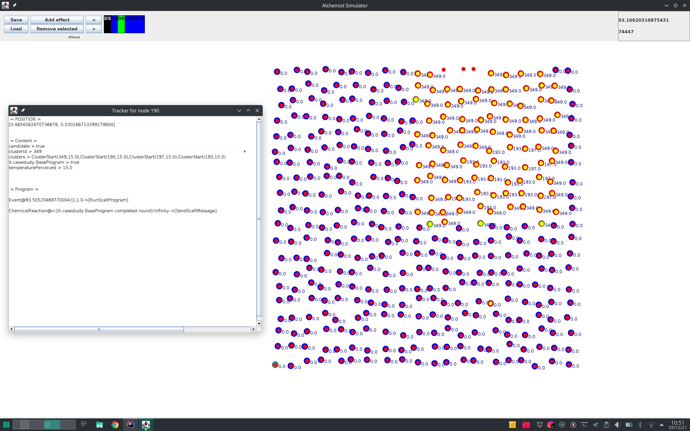

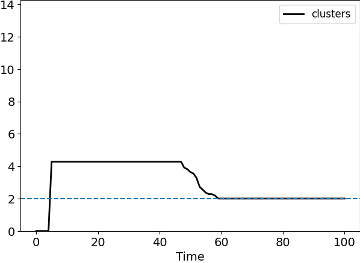
```
./gradlew runUniformLayersGraphic 
```

### Non-Convex Layers Distribution 
> *nonConvexLayers*

:open-hand:

This experiment is similar to [Uniform Layers Distribution](#uniform-layers-distribution), but the cluster share is non-convex.
So, as the previous example, the program cannot find correct cluster distribution.

The merge strategy helps, but the program find three cluster instead of two.
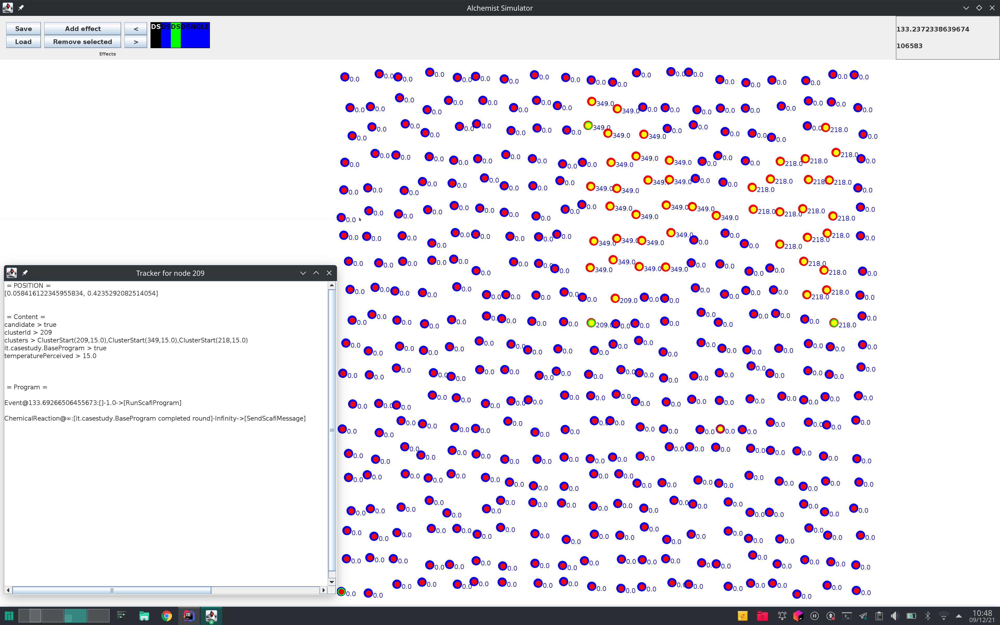

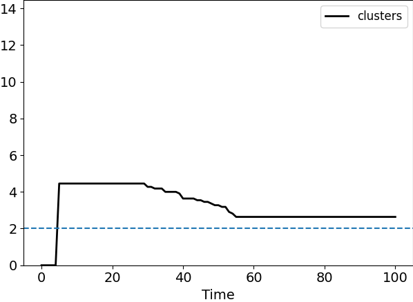
```
./gradlew runUniformLayersGraphic 
```
 
### Uniform increasing temperature field
> *oneDirectionField*

:-1:

In this experiment the temperature field grows from the left to the right uniformly.
In particular, the temperature at each point is evaluated as:

temp(x, y) = baseValue + (centerX - x) * dx + (centerY - y) * dy

where `dx = 0.1`, `dy = 0.0` and `centerX = centerY = 1`
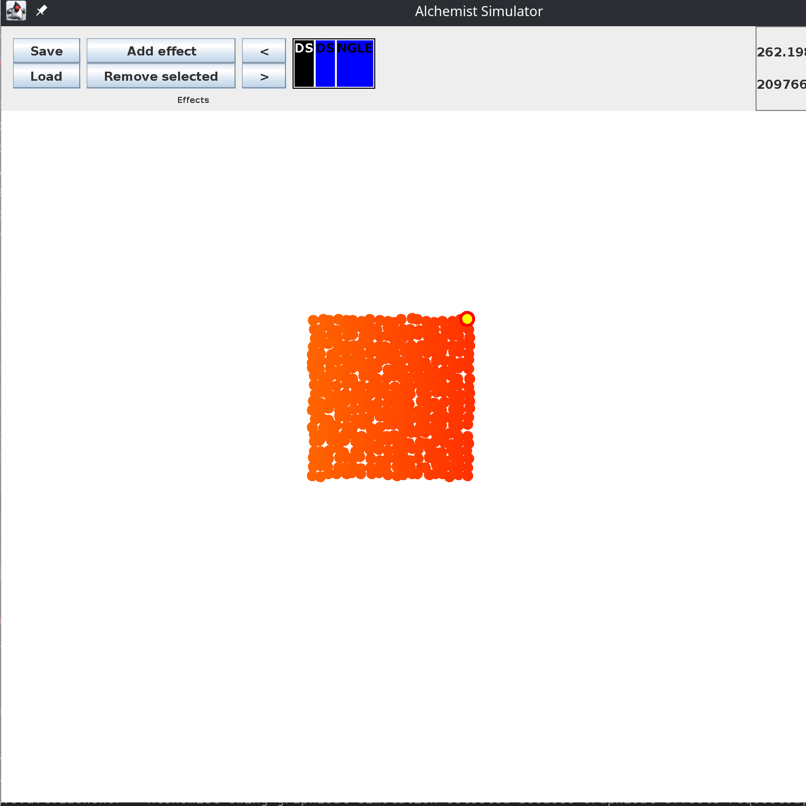

The lighter the color the lower the temperature.

In this experiment, there are more local minimum and so multiple clusters are found.

The merge policy helps, but here is very slow (because it needs to share the cluster process information within the all system)
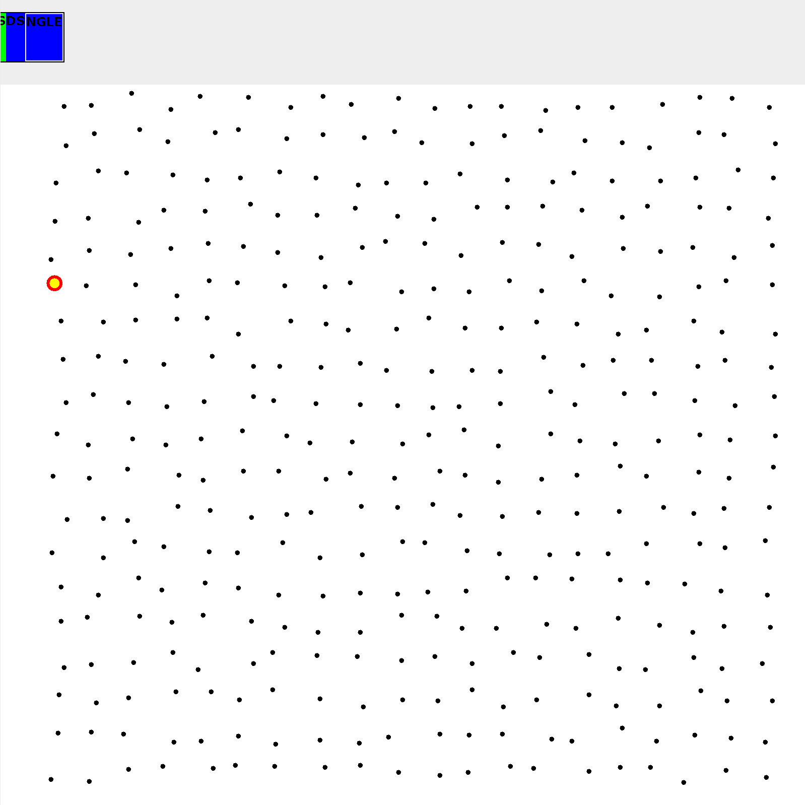

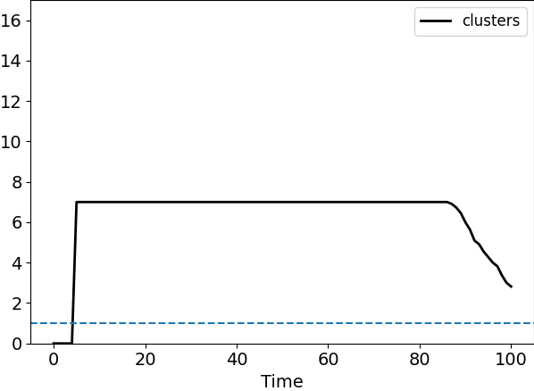
```
./gradlew runOneDirectionFieldGraphic 
```

### Uniform increasing temperature field with a local minimum
> *oneDirectionFieldLocalMinimum*

:+1:

Similar to the previous example, but the temperature grows with dx = dy = 0.05:
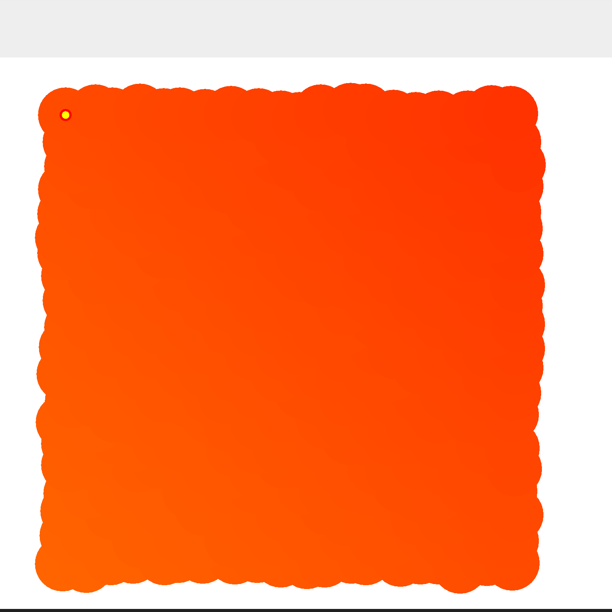
In this case, the algorithm works as excepted
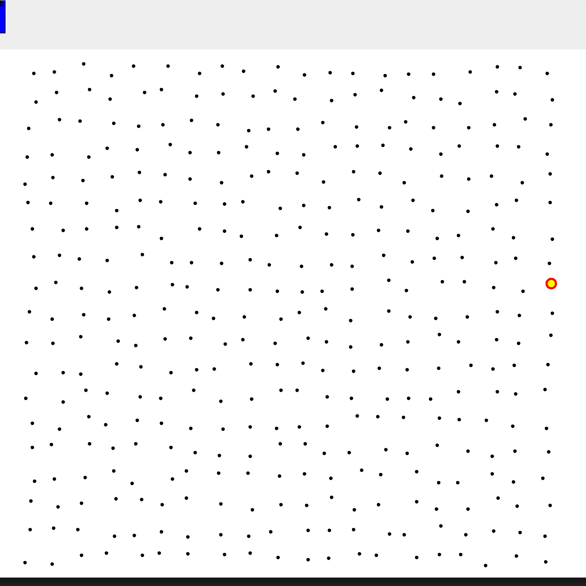


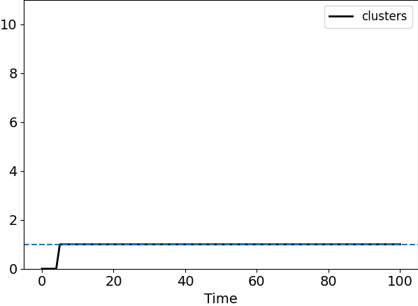
```
./gradlew runOneDirectionFieldMinimumGraphic 
```


## Todo
- [ ] Use a metric to evaluate the cluster created with Aggregate Computing (see related works for that)
- [ ] Find a way to plot different clusters (currently you need to inspect each node)
- [x] Try to generalise the cluster formation (i.e. candidate selection, in condition, out condition, live condition)
- [x] Try to create cluster using G and C (link to the previous work)

## Problems
- Initially, there is a lot of noise due to candidate selection.
- `W` parameter is quite important. With wrong W the Aggregate Program find bad clusters.
